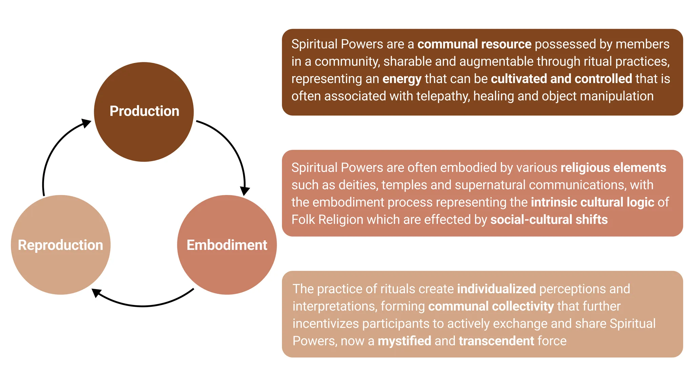
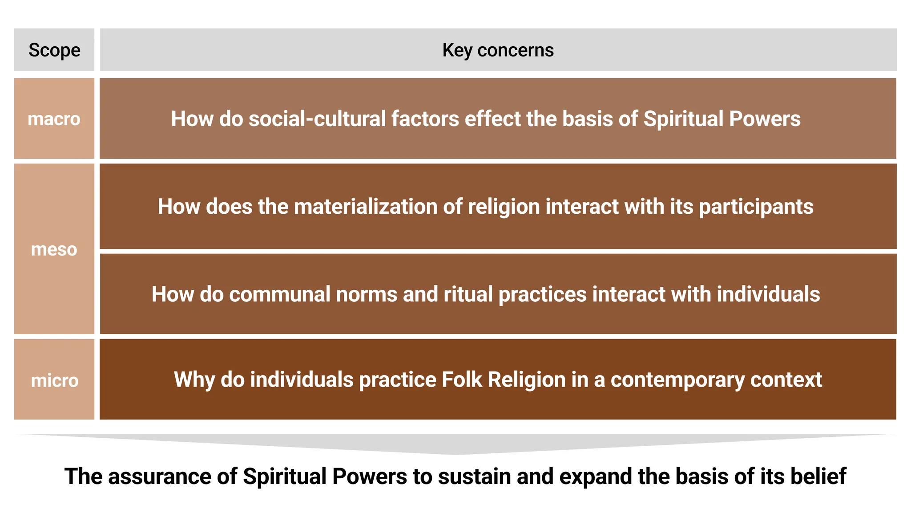
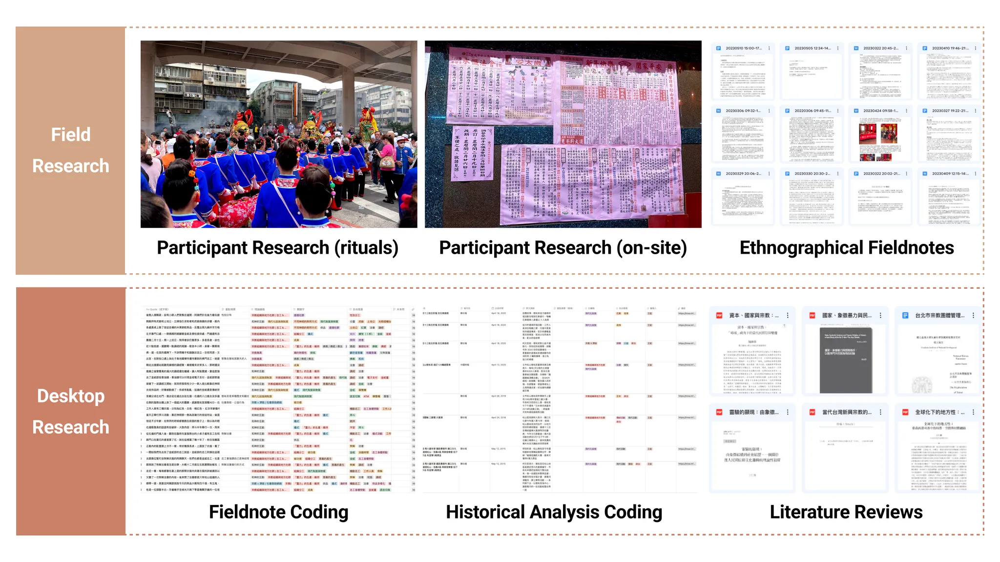
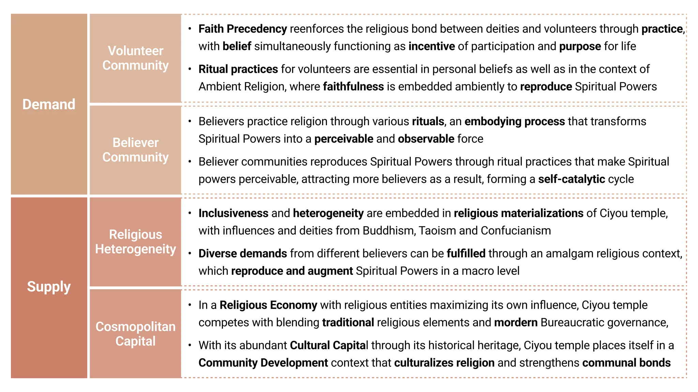

# The Assurance of Spiritual Powers in Contemporary Taiwanese Folk Religion

https://github.com/user-attachments/assets/9c10cc4d-3a31-4378-9528-5f421796086e

*During the birthday of 媽祖 (mā zǔ, a deity in Chinese and Taiwanese Folk Religion), various rituals will be held by the temple and its community, participating in a grand celebration named 遶境 (rào jìng, a circular movement within a particular area). 軁轎跤 (nǹg-kiō-kha, going through under the Mikoshi, a sacred vehicle that transports deities) is one of the most important rituals for believers, believing that passing under the Mikoshi brings good fortune and blessing. Video by me*

- ### Project Summary
  - #### Project Overview
    This project is aimed to conceptualize the assurance of Spiritual Powers in a contemporary Taiwan context with Songshan Ciyou Temple as an example, one of the most culturally and historically significant temples in Taiwan. This project leverages multiple qualitative research methods, such as Participant Research and Grounded Theory. This project is led by Professor Ke-Hsien Huang from the Department of Sociology at National Taiwan University and is co-authored with five people, serving as the final report of the course Qualitative Research Methods.

  - ### Results Summary
    The embodiment of ritual practices in the in-temple volunteer communities and external believers has reproduced the Spiritual Powers of Ciyou Temple, reinforcing the religious bond between deities and volunteers through the practice of rituals. In addition, the religious heterogeneity and cosmopolitan nature of the temple have augmented the basis of its Spiritual Powers with modernized Bureaucratic methods and publicized religious experiences. 
  
  - #### Project Snapshot
    - **Research Paradigm:** Sociology of Religion
    - **Research Methods:** Content Analysis, Historical Analysis, Grounded Theory, Participant Research, Ethnographic Research
    - **Responsibilities:** 10+ hours of on-site participant observation, document analysis, data coding, conceptualization of the main argument
   
  - ### Literature Review
    We started by clarifying the conception of Spiritual Powers and identified its key attributes, including being exchangeable, cultivatable, embodiable, and so on,  and how it comes into play in our context.
    

  - ### Analytical Framework
    We identified various mechanisms that influence Spiritual Powers on micro, meso, and macro levels, conceptualizing a precedent framework prior to field entry.
    

  - ### Research Methods
    Our research is mainly conducted with extensive Field Research based on a Grounded Theory approach, supplemented by Desktop Research methods to robustify and categorize qualitative data.
    

  - ### Implications and Results
    The assurance and augmentation of Spiritual Powers exist at all levels: personalized ritual practices at micro levels form communal bonds and embed ambient faithfulness that interacts with other participants at a meso level, where Ciyou temple further expands its basis at a macro level through religious heterogeneity and its cosmopolitan capital, promoting communal and cultural values in a greater context.
    
